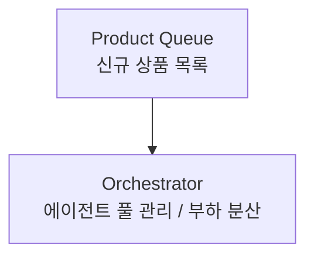

흐름, 로직, 구조, 데이터 흐름, 시스템 설계 등을 설명할 때는 반드시 다이어그램을 먼저 제시한 뒤 산문으로 설명한다.

## 다이어그램 사용 기준

다음 상황에서는 항상 다이어그램(Mermaid 또는 ASCII 와이어프레임)을 포함한다:

- **제어 흐름**: 조건문, 반복문, 분기 처리 로직
- **시스템 구조**: 컴포넌트 간 관계, 모듈 의존성, 아키텍처
- **데이터 흐름**: 요청/응답 경로, 파이프라인, 데이터 변환 과정
- **상태 변화**: 상태 머신, 생명주기, 이벤트 처리 순서
- **시퀀스**: API 호출 흐름, 함수 호출 순서, 비동기 처리
- **UI / 레이어 구조**: 화면 레이아웃, 레이어 간 의존 관계 → ASCII 와이어프레임 사용

## 다이어그램 타입 선택 기준

| 상황 | 다이어그램 타입 |
|------|----------------|
| 제어 흐름, 분기 로직 | `flowchart TD` |
| 함수/서비스 간 호출 순서 | `sequenceDiagram` |
| 상태 전이 | `stateDiagram-v2` |
| 클래스/인터페이스 구조 | `classDiagram` |
| DB 스키마, 엔티티 관계 | `erDiagram` |
| 타임라인, 단계적 흐름 | `graph LR` |
| UI 레이아웃, 화면 구조, 컴포넌트 배치, 레이어 간 관계 — 박스 내부가 영문 식별자만인 경우 | ASCII 와이어프레임 (Box Drawing) |
| UI/레이어 구조이지만 노드 내부에 한국어 설명이 필요한 경우 | `flowchart TD` (Mermaid) |

## ASCII 와이어프레임 작성 규칙

UI 레이아웃, 화면 구성, 컴포넌트 배치, 레이어 간 관계를 설명할 때는 Mermaid 대신 Box Drawing Characters로 와이어프레임을 그린다.

**단, 박스 내부에 한국어 내용이 필요한 노드가 하나라도 있으면 ASCII 와이어프레임을 쓰지 말고 Mermaid를 쓴다.**

### 테두리 깨짐 — 원인과 절대 규칙

Box Drawing 문자(┌─┐│└┘)는 Unicode "Ambiguous Width"로, 렌더러마다 1컬럼 또는 2컬럼으로 달리 처리된다. 한국어(항상 2컬럼)와 같은 박스 안에 넣으면 테두리가 어긋난다.

**박스 내부에 허용되는 것** (테두리 안전):
- 영문 식별자: `Header`, `Orchestrator`, `Product Queue`
- 숫자와 기호: `[1]`, `[A]`, `(N workers)`
- 영문 약어: `API`, `LLM`, `KB`, `QA`

**박스 내부에 절대 금지** (테두리 반드시 깨짐):
- 한국어 텍스트: `[신규 상품 목록]`, `에이전트 풀 관리`
- 한국어가 섞인 혼합: `Queue [신규]`, `API로 조회`
- 화살표 사이 레이블로도 한국어 금지: `──요청──→` 불가

**화살표 사이 레이블은 영문으로만 작성한다.** 한국어 설명이 필요하면 다이어그램 아래 줄에 따로 쓴다.

### 한국어 내용을 표현하는 패턴

**패턴 A — 외부 화살표 설명** (노드 이름 한 줄 설명)

```
┌──────────────────────┐
│ Product Queue        │ ← 신규 상품 목록
└──────────────────────┘
```

**패턴 B — 번호 레이블 + 범례** (노드 내부 목록이 필요할 때)

내부에 번호 식별자만 넣고, 박스 아래에 범례를 이어서 쓴다.

```
┌──────────────────────┐
│ Inspection Agent     │
│  [1] [2] [3] [4]    │
└──────────────────────┘

[1] API로 상품 데이터 수집
[2] 기준 대조 (LLM + KB)
[3] 합/불합 판정
[4] API로 결과 등록
```

**패턴 C — Mermaid로 전환** (노드 내부 설명이 2줄 이상이거나 한국어 포함)

ASCII 박스를 쓰지 말고 `flowchart TD`를 사용한다. Mermaid는 노드 레이블에 한국어를 안전하게 쓸 수 있다.



### UI 레이아웃 — 세로 분할

```
┌─────────────────────────────────────┐
│ Header                              │ ← 헤더
├──────────┬──────────────────────────┤
│          │  ┌────────┐  ┌────────┐  │
│ Sidebar  │  │ Card 1 │  │ Card 2 │  │ ← 카드 목록
│          │  └────────┘  └────────┘  │
└──────────┴──────────────────────────┘
```

### 레이어 관계 — 세로 의존 (상위 → 하위)

```
┌─────────────────────────────────────┐
│ Presentation Layer                  │ ← 표현 레이어
└──────────────────┬──────────────────┘
                   │ fetch
                   ↓
┌─────────────────────────────────────┐
│ Business Layer                      │ ← 비즈니스 레이어
└──────────────────┬──────────────────┘
                   │ ORM query
                   ↓
┌─────────────────────────────────────┐
│ Data Layer                          │ ← 데이터 레이어
└─────────────────────────────────────┘
```

### 레이어 관계 — 가로 흐름 (파이프라인 / 요청 흐름)

```
┌──────────┐  request  ┌──────────┐  query  ┌──────────┐
│ Browser  │ ────────→ │  Server  │ ──────→ │    DB    │
└──────────┘           └──────────┘         └──────────┘
```

가로 배치는 다음 상황에 사용한다:
- 요청이 왼쪽에서 오른쪽으로 순서대로 흐르는 파이프라인
- 마이크로서비스 간 수평 통신
- CI/CD 파이프라인, 데이터 처리 단계

## 다이어그램 작성 규칙

- 노드는 최대 15개 이하로 유지한다. 복잡하면 주요 흐름과 세부 흐름으로 분리한다.
- 노드 레이블은 한국어로 작성한다. 코드 식별자(함수명, 변수명 등)는 원문 그대로 사용한다.
- 다이어그램 위에 한 줄로 무엇을 나타내는지 설명한다.

## 응답 구조

흐름/구조 설명 시 다음 순서로 응답한다:

1. **다이어그램** — 전체 흐름을 한눈에 파악할 수 있도록
2. **핵심 설명** — 다이어그램의 주요 포인트를 간결하게
3. **세부 설명** — 필요한 경우 각 단계별 상세 내용

단순한 사실 질문(예: "이 함수의 반환 타입이 뭐야?")이나 코드 수정 요청에는 다이어그램을 생략한다.
